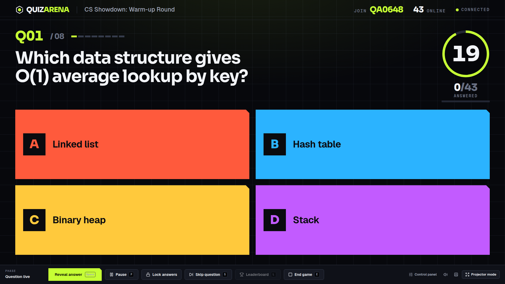
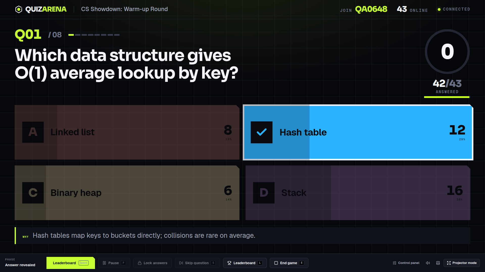
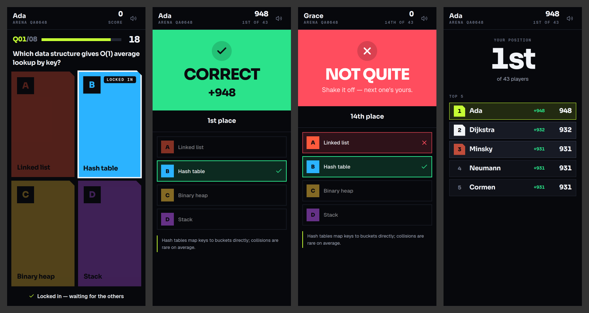
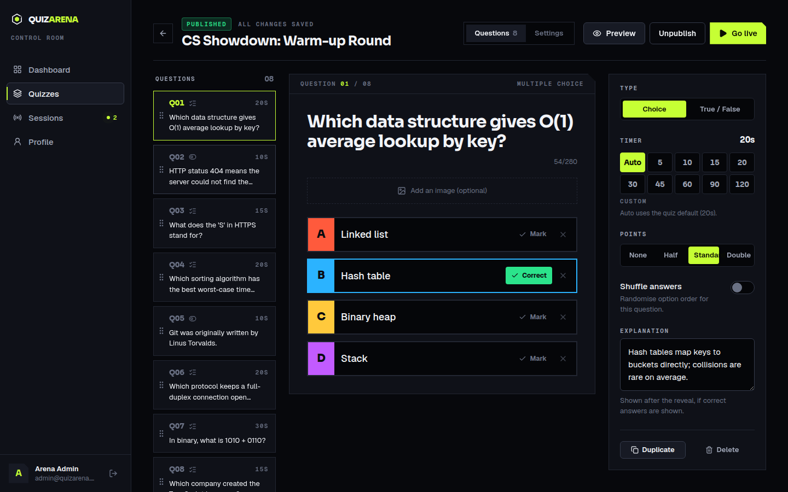
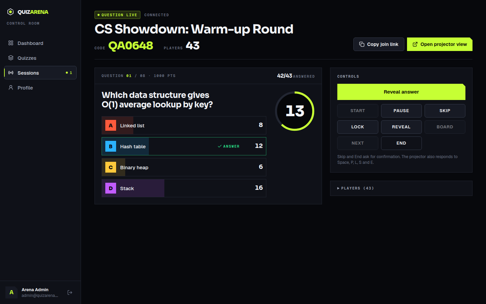

# QUIZARENA

**100 Players. One Arena.**

QuizArena is a real-time multiplayer quiz platform for classrooms, campuses, ACM chapters,
hackathons and company events. An organiser builds a quiz, puts the arena on a projector,
and everyone in the room answers from their phone. Scores, reveals and leaderboards update
the moment the timer hits zero.



| Projector reveal                                 | Phone flow                                               |
| ------------------------------------------------ | -------------------------------------------------------- |
|  |                |
| **Quiz editor**                                  | **Live control panel**                                   |
|      |  |

---

## Features

**Admin portal** (`/admin`)

- Sign-in, dashboard (quizzes, sessions, participants, live now), quiz library with filters
- **Team** (admins): create sign-ins (email + password) for other people and share them, with
  no email verification. Reset passwords, make admin / organiser, disable or delete. Each person
  only sees their own quizzes
- Three-pane question editor: navigator with drag-and-drop ordering (keyboard accessible),
  question workspace, and settings rail; autosave with an honest save-status line
- Multiple choice (2–4 options) and true/false; per-question timer, points, explanation, answer
  shuffling, and tags / category / difficulty. New question types plug into a registry
  (`packages/shared/src/question-types.ts`)
- **Question images:** upload from the device (drag and drop, progress bar, automatic
  resizing), the media library, **Google Drive** (real OAuth, read-only) or a link. Frame the
  image with Fit (whole / fill) and Position (center / top / bottom). See [docs/MEDIA.md](docs/MEDIA.md)
- **Question videos:** MP4 or WebM up to 100 MB, from the device, the library or Google
  Drive. Uploads go straight to the bucket via a presigned URL, with real progress, a server
  check of the file's bytes, and a poster frame. The projector plays them muted, pausing as
  answers lock; the host can replay or unmute from the control room. Phones show a cue
  instead of streaming. See [docs/MEDIA.md](docs/MEDIA.md#question-videos)
- **Media library:** images and videos, kind filter, search, sort, unused filter, hover
  preview for videos, rename, delete (warns about questions that use the file). Images are stored as optimized WebP in object storage, never in the
  database
- **Question bank:** every question across all quizzes, filtered by text, tag, category,
  difficulty, type or quiz; add copies to any quiz
- Quiz settings: default timer, reading period (countdown / host starts / none), speed/accuracy
  scoring, streak bonus, shuffle questions/answers, leaderboard every N questions, auto-reveal
  after time's up, correct answers, answer stats, late join, participant limit, sound, nickname
  filter. **Settings** holds the defaults every new quiz starts from
- **Customize arena:** theme, colours, type, motion and branding for the projector and phones,
  per quiz or as the default, previewed live by the real screens (Open / Fullscreen / Refresh)
- **Import questions** from a CSV or Excel (.xlsx) file, or from a Google Sheets / Google Drive
  share link ("Anyone with the link can view"). Columns are matched by name (Question,
  Option A–D, Correct answer, Time limit, Points, Explanation, Image URL), Kahoot's spreadsheet
  template works as-is, and every row is previewed with its problems before anything is saved.
  A template CSV can be downloaded from the import dialog
- **Two themes, one day/night switch:** Black + Orange (night) and White + Blue (day). A
  single sun/moon icon morphs as it switches, and the new theme spreads out from it across
  the page. Remembered per browser; a first visit follows the system setting. The projector
  and phones follow each quiz's own arena theme (one of the same two)
- Draft/published states; publishing and going live are blocked until every question is complete
- Duplicate/delete quizzes and questions, one-click **Go live**
- Admin sections: Dashboard, Quizzes, Question bank, Media library, Live sessions, Results,
  Customize arena, Settings
- Session history with results, podium, per-player accuracy/response time/streaks, **CSV export**

**Host control room** (`/host/QA482193`, the host's laptop)

- Status at a glance: state, time left (to the tenth of a second), players, answered, waiting
- The question with its **answer key** and live answer split; who is still thinking
- Controls: start timer, pause/resume, −5s / +5s / +10s, lock, show answers, reveal,
  leaderboard, next, skip, end. Keyboard: `Space` continue · `P` pause · `L` leaderboard ·
  `S` skip · `E` end · `O` open projector · `F` fullscreen preview
- Last-minute session settings in the lobby (theme, timer, reading time, leaderboard, sound,
  animation, late join, player limit) that leave the saved quiz untouched
- Host-paced podium: Reveal 3rd → 2nd → 1st → Show full leaderboard
- **Live projector preview** of the real stage, with Open projector and Fullscreen

**Projector stage** (`/host/QA482193/projector`, the audience screen)

- Shows only audience content: no controls, answer key or connection details. It receives
  only the server's audience-safe view
- Built for 1080p, 1440p and 4K, readable at distance (viewport-relative type scale)
- Lobby "Join the arena" with giant PIN, join URL and QR code; players animate in (batched)
- Synced start sequence, then **Read the question** with its own countdown
- Countdown escalating at 10 / 5 / 3 / 1 / 0 seconds; "Time's up" when locked
- **What did everyone choose?** Bars grow from zero while counts and percentages tick up; the
  correct bar takes the spotlight on the reveal
- Layout-animated leaderboard (overtakes are visible) and a cinematic podium the host paces,
  ending in a paged full leaderboard (rank, player, points, correct, accuracy, streak)
- Next question's image preloads during the reveal; images fade in over a blurred placeholder
  inside a fixed frame, so nothing jumps

**Players** (`/play`)

- Code → nickname → arena. Mobile-first, four thumb-sized answer buttons (`1–4`/`A–D` on desktop)
- Reading screen with a countdown, then the answers; locked-in state, "answers are in", a
  correct/incorrect reveal with a "+850" score pop, streaks and rank movement, and a final
  placement that waits for the podium on the big screen
- Seats survive refreshes, phone locks and network drops (reconnect tokens)
- Polished error states: invalid code, game started/ended, name taken, arena full, connection lost

**Realtime & safety**

- Server-authoritative engine: correct answers, timers, scores, ranks and phase transitions never
  leave the server's control; late/duplicate/invalid answers are rejected by server timestamp
- Load-tested: **500 simulated players** on one node with zero errors, answer acks p99 ≈ 2 ms

## Architecture

```
apps/
  web/        Next.js 16 · React 19 · Tailwind v4 · Motion — admin, projector, player (one app)
  server/     Fastify 5 · Socket.IO 4 · Prisma 7 — REST API, realtime gateway, game engine
packages/
  shared/     Typed socket contract, Zod schemas, game views, scoring, question-type registry
docs/         ARCHITECTURE.md · DEPLOYMENT.md · screenshots
```

```
 Phones ──┐                         ┌──────────── game server (Railway/Render/Fly) ─────────────┐
          │  WebSocket (Socket.IO)  │  Gateway ─► GameRoom (in-memory, authoritative) ──► Prisma │──► PostgreSQL
Projector ┼────────────────────────►│     ▲                                                     │
          │                         │  Fastify REST (/api/*)   optional Redis adapter (fan-out) │
 Admin  ──┘── HTTPS /api/* ──► Next.js on Vercel (rewrite proxy, first-party cookie) ───────────┘
```

Why a single Next.js app rather than three: the three experiences share a design system, socket
client and auth proxy, deploy as one Vercel project, and map directly onto the URL structure
(`/admin`, `/host/[code]`, `/play`). See **[docs/ARCHITECTURE.md](docs/ARCHITECTURE.md)** for the
game engine, state machine, event contract, security model and scaling path.

## Tech stack

| Layer      | Choice                                                                                                        |
| ---------- | ------------------------------------------------------------------------------------------------------------- |
| Frontend   | Next.js 16 (App Router), React 19, TypeScript, Tailwind CSS v4, Motion, TanStack Query, dnd-kit, Radix Dialog |
| Realtime   | Socket.IO 4 (WebSocket first, long-polling fallback), optional `@socket.io/redis-adapter`                     |
| Backend    | Node 22, Fastify 5, Zod 4, jose (JWT), bcrypt                                                                 |
| Data       | PostgreSQL + Prisma 7 (driver adapter `@prisma/adapter-pg`)                                                   |
| Typography | Sora (display & numerals), Geist (UI), Geist Mono (labels & data)                                             |
| Tooling    | pnpm workspaces, Vitest, ESLint 9 (flat), Prettier, GitHub Actions                                            |

## Local development

Prerequisites: **Node 22.12+**, **pnpm 10**, **PostgreSQL 14+**.

```bash
pnpm install

# environment
cp apps/server/.env.example apps/server/.env      # set DATABASE_URL, JWT_SECRET, SEED_ADMIN_*
cp apps/web/.env.example apps/web/.env.local

# database
createdb quizarena                                 # or use Neon/Supabase
pnpm db:migrate                                    # apply migrations (dev)
pnpm db:seed                                       # admin account + sample quiz

# run both apps
pnpm dev                                           # web → http://localhost:3000, server → :4000
```

Sign in at <http://localhost:3000/admin> with `SEED_ADMIN_EMAIL` / `SEED_ADMIN_PASSWORD`, hit
**Go live** on the sample quiz, open the projector view, and join from another tab or a phone at
`/play`.

## Environment variables

**Game server** — `apps/server/.env`

| Variable                                                                                                  | Required            | Description                                                                      |
| --------------------------------------------------------------------------------------------------------- | ------------------- | -------------------------------------------------------------------------------- |
| `DATABASE_URL`                                                                                            | ✓                   | PostgreSQL connection string                                                     |
| `JWT_SECRET`                                                                                              | ✓                   | ≥ 32 chars; signs session cookies and socket tickets (`openssl rand -base64 48`) |
| `WEB_ORIGIN`                                                                                              | ✓ in prod           | Comma-separated allowed browser origins (your Vercel URL)                        |
| `PORT` / `HOST`                                                                                           |                     | Listen address (default `4000` / `0.0.0.0`)                                      |
| `NODE_ENV`                                                                                                |                     | `production` enables secure cookies and JSON logs                                |
| `TRUST_PROXY`                                                                                             |                     | `true` behind a load balancer so rate limits see client IPs                      |
| `REDIS_URL`                                                                                               |                     | Enables the Socket.IO Redis adapter                                              |
| `ALLOW_REGISTRATION`                                                                                      |                     | `true` allows `POST /api/auth/register`                                          |
| `LOG_LEVEL`                                                                                               |                     | `info` by default                                                                |
| `SEED_ADMIN_EMAIL` / `SEED_ADMIN_PASSWORD` / `SEED_ADMIN_NAME`                                            | seed only           | First admin account                                                              |
| `MEDIA_STORAGE`                                                                                           |                     | `local` (dev disk), `s3` or `none` — see [docs/MEDIA.md](docs/MEDIA.md)          |
| `S3_ENDPOINT` / `S3_BUCKET` / `S3_ACCESS_KEY_ID` / `S3_SECRET_ACCESS_KEY` / `S3_PUBLIC_URL` / `S3_REGION` | for uploads in prod | Any S3-compatible bucket (Cloudflare R2, Supabase Storage, AWS S3)               |
| `GOOGLE_CLIENT_ID` / `GOOGLE_CLIENT_SECRET` / `GOOGLE_REDIRECT_URI`                                       | for Drive           | Google OAuth web client for the Drive image picker                               |
| `GOOGLE_TOKEN_KEY`                                                                                        |                     | Encrypts stored Google refresh tokens (default: derived from `JWT_SECRET`)       |

**Web** — `apps/web/.env.local` (Vercel project settings in production)

| Variable                   | Description                                                          |
| -------------------------- | -------------------------------------------------------------------- |
| `API_ORIGIN`               | Game server URL that `/api/*` is proxied to. **Read at build time.** |
| `NEXT_PUBLIC_REALTIME_URL` | Game server URL the browser's socket connects to                     |
| `NEXT_PUBLIC_SITE_URL`     | Public site URL used in join links and QR codes                      |

No secret is ever exposed to the browser: the web app only knows public URLs.

## Commands

| Command                              | What it does                                                                             |
| ------------------------------------ | ---------------------------------------------------------------------------------------- |
| `pnpm dev`                           | Run server and web in watch mode                                                         |
| `pnpm typecheck`                     | TypeScript across all packages                                                           |
| `pnpm lint`                          | ESLint across all packages                                                               |
| `pnpm test`                          | Vitest: scoring, nicknames, game engine, socket gateway, REST API (needs `DATABASE_URL`) |
| `pnpm build`                         | Production builds (server bundle via tsup, Next.js build)                                |
| `pnpm format` / `pnpm format:check`  | Prettier                                                                                 |
| `pnpm db:migrate` / `pnpm db:deploy` | Prisma migrations (dev / production)                                                     |
| `pnpm db:seed`                       | Admin account + sample quiz                                                              |
| `pnpm loadtest -- --players 100`     | Plays a full game with N simulated players against a running server                      |

## Testing

```bash
pnpm test
```

- **Engine (30+ tests):** every phase transition, command gating, timer expiry and auto-lock,
  late answers by server timestamp, duplicate/invalid answers, pause-adjusted response times,
  reveal-time scoring and privacy (no correctness before reveal), ranking tie-breaks, skip,
  reconnect tokens, lobby eviction, concurrent joins vs participant limit
- **Gateway:** real Socket.IO clients — host authorization, ticket scoping, isolation between
  players, seat takeover on reconnect, offline detection
- **API:** auth, ownership isolation, publish validation, stable option ids, reorder, duplicate,
  session lookup, CSV formula-injection guard

**Load simulation** (server must be running and seeded):

```bash
pnpm loadtest -- --players 100            # default API http://localhost:4000
```

Measured locally (single node, one quiz): 150 players → ack p99 4 ms, slowest broadcast fan-out
115 ms; 500 players → ack p99 2 ms, fan-out 134 ms, zero errors.

## Production build

```bash
pnpm build
pnpm --filter @quizarena/server start      # node dist/index.js
pnpm --filter @quizarena/web start         # next start
```

## Deployment

- **Frontend → Vercel** (root directory `apps/web`)
- **Game server → Railway / Render / Fly.io** (`apps/server/Dockerfile`; `railway.json`,
  `render.yaml`, `fly.toml` included). It must be a long-running process: WebSockets do **not**
  run on Vercel serverless functions.
- **Database → Neon / Supabase / any PostgreSQL**
- **Redis → optional**, for multi-node fan-out

Step-by-step instructions: **[docs/DEPLOYMENT.md](docs/DEPLOYMENT.md)**.

## WebSocket architecture (summary)

- Phase changes are broadcast as **role-specific snapshots** (`session:state`): one host view to
  the hosts room, one personalised view per player. Snapshots make reconnection trivial and
  remove ordering bugs; player views are < 1 KB and never contain the answer key.
- High-frequency facts (joins, answer counts) go to hosts as small, throttled deltas.
- Timers are server deadlines; clients estimate clock offset (`timer:sync`) only for display.
- Hosts authenticate with a 60-second ticket from the cookie-authenticated API; players hold
  an opaque reconnect token (only its SHA-256 is stored).
