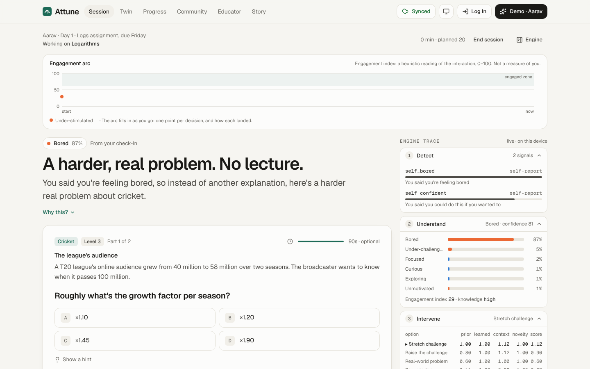
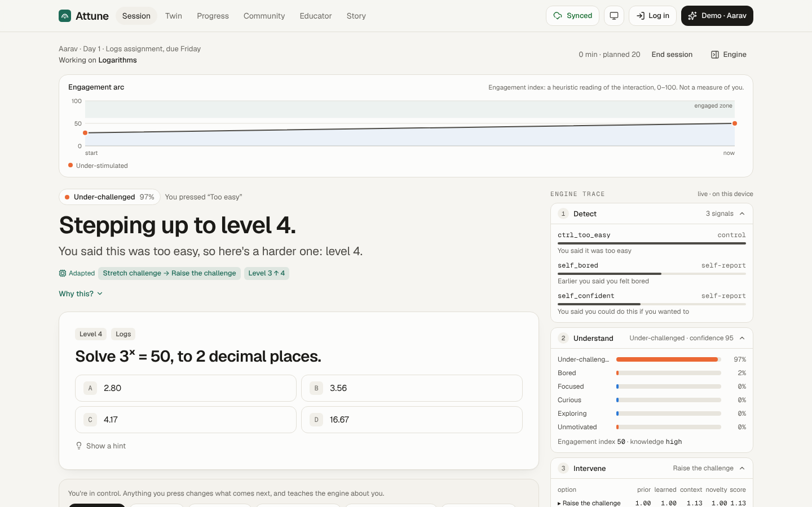
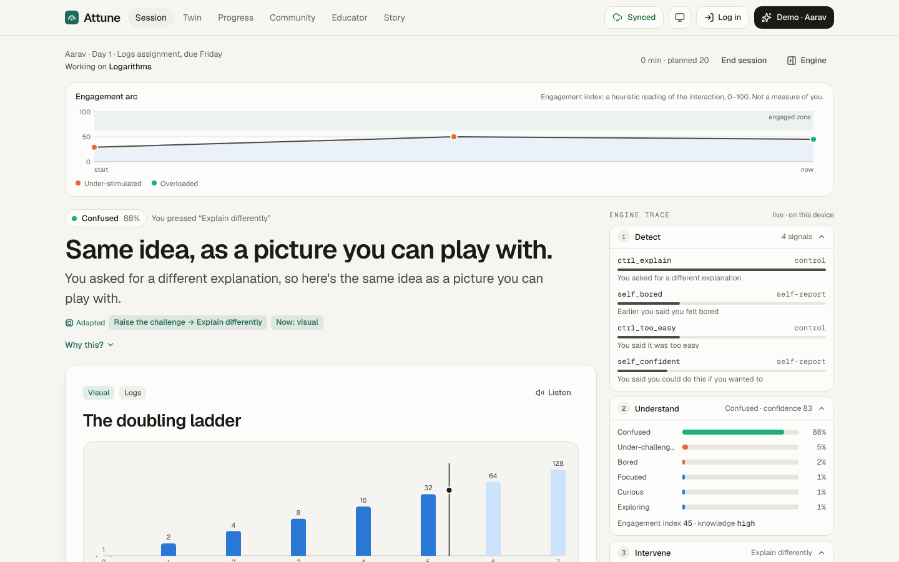
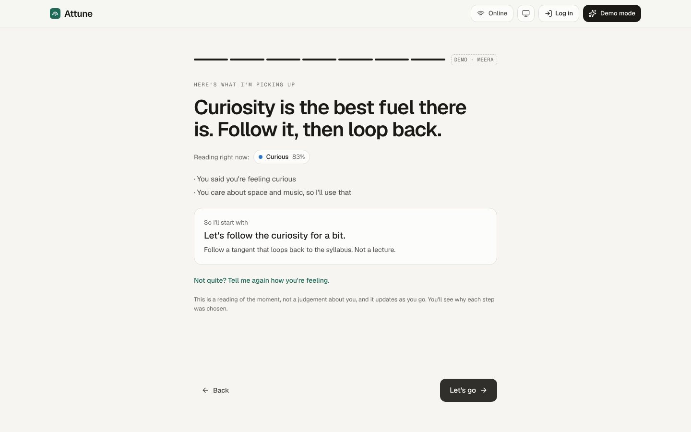
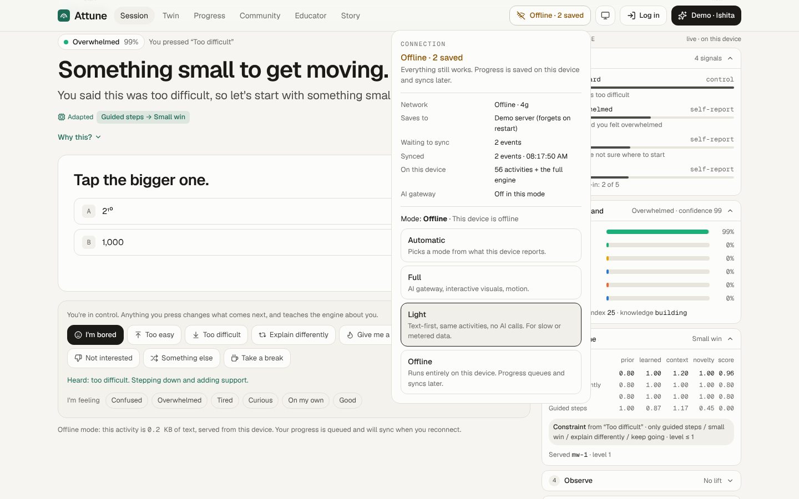
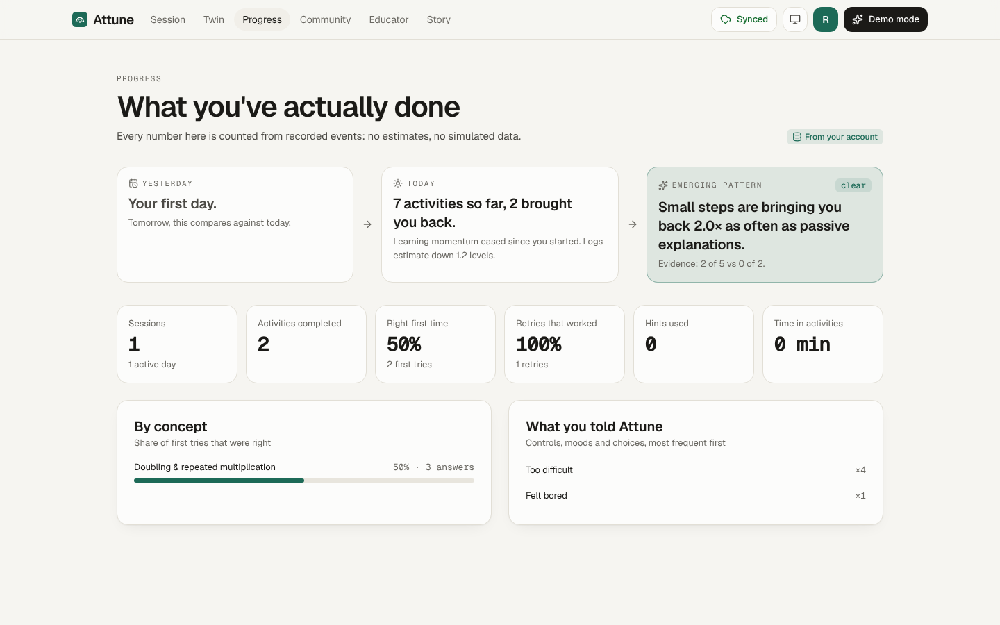
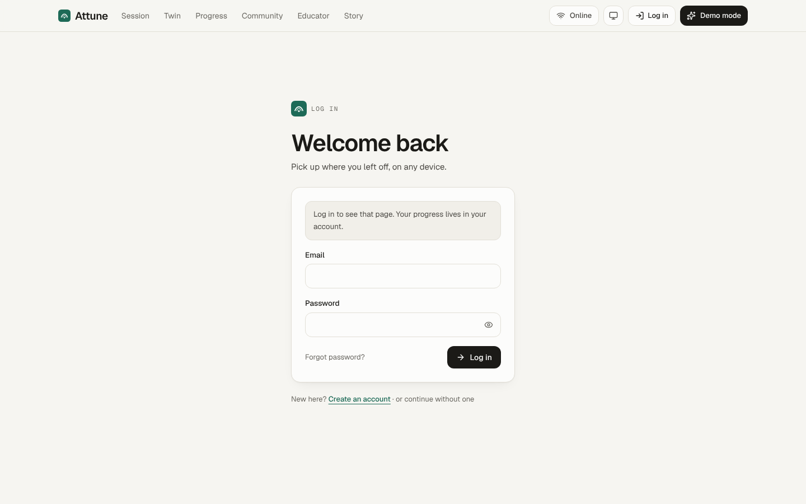
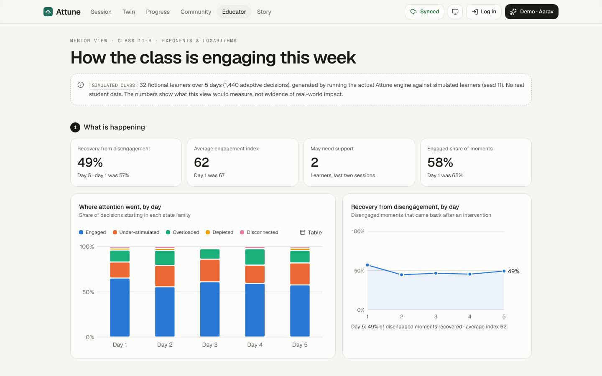
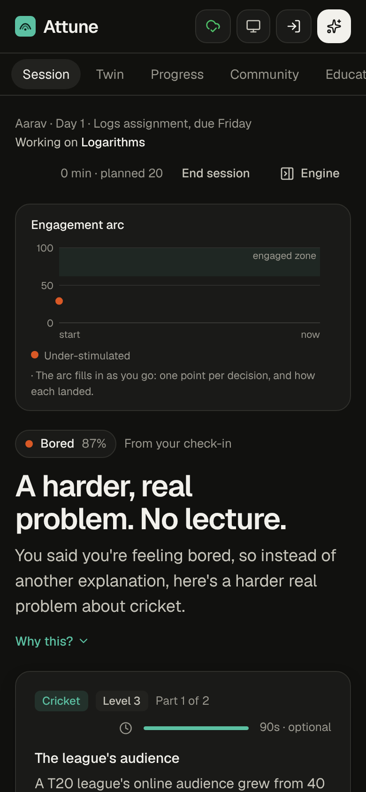

# Attune

> **Not personalized content. Personalized engagement.**

Attune is an engagement intelligence layer for learners. It works out _why_ a learner has
disengaged (bored, stuck, tired, curious, or alone) and changes the next few minutes to fit. It
explains every decision, lets the learner overrule it, learns from what actually brings them back,
and runs on a cheap phone with no connection.



| "Too easy": strictly harder, with the reason            | "Explain differently": a new modality                                                |
| ------------------------------------------------------- | ------------------------------------------------------------------------------------ |
|  |         |
| **Check-in reflection**                                 | **Offline: events queue, then sync**                                                 |
|  |                                 |
| **Progress, counted from Postgres (signed in)**         | **Log in (protected pages redirect here)**                                           |
|  |                                    |
| **Mentor view (labelled simulated class)**              | **Phone, dark mode**                                                                 |
|  |  |

- Product architecture and the reasoning behind it: [`docs/attune/PRODUCT.md`](../../docs/attune/PRODUCT.md)
- The engine (pure TypeScript, tested): [`packages/engine`](../../packages/engine)

## Run it

```bash
pnpm install
pnpm --filter @attune/web dev      # http://localhost:3100
```

That's enough to use everything on one device: no account, no database. Progress then syncs to
an in-memory demo server (labelled as such in the connection panel), which forgets on restart.

To turn on **accounts and persistence**, point the app at a Supabase project (free tier) or at the
local Supabase stack below. Copy `.env.example` to `.env.local` and fill in two public values.

Optional: set `ANTHROPIC_API_KEY` (server only) to enable the AI gateway, which rewrites
explanations around a learner's interests. Without it everything works: the engine decides, the
library text is shown, and the UI says the gateway isn't configured.

## Accounts and database (Supabase Free)

| What                                                             | Where                                                                                                              |
| ---------------------------------------------------------------- | ------------------------------------------------------------------------------------------------------------------ |
| Schema: tables, constraints, indexes, triggers, RLS policies     | [`supabase/migrations/20261008080000_attune_schema.sql`](supabase/migrations/20261008080000_attune_schema.sql)     |
| Activity catalogue (generated from the app bundle, drift-tested) | [`supabase/migrations/20261008080100_seed_activities.sql`](supabase/migrations/20261008080100_seed_activities.sql) |
| Database tests (pgTAP: provisioning, derivation, replay, RLS)    | [`supabase/tests/database/attune.test.sql`](supabase/tests/database/attune.test.sql)                               |
| Local stack settings (auth, email, rate limits)                  | [`supabase/config.toml`](supabase/config.toml)                                                                     |

**Environment variables** (both public by design: Row Level Security decides what each user can
read or write; the app never uses, needs or ships the service-role key):

```bash
NEXT_PUBLIC_SUPABASE_URL=https://<project-ref>.supabase.co
NEXT_PUBLIC_SUPABASE_PUBLISHABLE_KEY=sb_publishable_...   # or the legacy anon key in NEXT_PUBLIC_SUPABASE_ANON_KEY
ANTHROPIC_API_KEY=                                        # optional, server only
```

### Hosted project, step by step

1. Create a project on the Free plan at supabase.com.
2. Apply the schema, either with the CLI (`npx supabase link --project-ref <ref>` then
   `npx supabase db push` from `apps/attune`), or by pasting the two migration files, in order,
   into the SQL editor.
3. **Authentication → URL configuration.** Set Site URL to your app's URL. Add
   `https://<your-app>/**` (and `http://localhost:3100/**` for development) to the redirect URLs.
   Confirmation and reset links come back through `/auth/callback`.
4. **Authentication → Providers → Email.** Keep "Confirm email" on. Supabase's built-in mailer is
   for testing: it only delivers to your project's team members, at a low hourly rate. For real
   learners, add an SMTP provider under Authentication → SMTP; several have free tiers.
5. **Settings → API keys.** Copy the project URL and the publishable key into the environment
   variables above. Never use the secret or service-role key in this app.
6. Optional, for confirming on a different device than the one that signed up: change the email
   templates' link to `{{ .SiteURL }}/auth/callback?token_hash={{ .TokenHash }}&type=email&next=/session`.
   The callback accepts both this and the default link.

### Local stack (Docker)

```bash
cd apps/attune
npx supabase start          # Postgres, Auth and Mailpit (http://127.0.0.1:54324) for emails
npx supabase test db        # 20 pgTAP tests
```

`supabase start` prints the local URL and publishable key for `.env.local`. They're local-only
values, not secrets.

### How persistence works

- **Events are the single write path.** The browser appends events under RLS (each one keyed by
  `(user_id, client_event_id)`, so a replayed batch is a no-op). A `SECURITY DEFINER` trigger derives
  `attempts`, `activity_progress` and `feedback` from them; clients can read those tables but
  can't write them.
- **The learner model** lives in `learner_models` with a `revision` column. Saves are optimistic:
  if another device saved first, the two models are merged (evidence unioned, never discarded) and
  saved again.
- **Sessions** keep a resumable snapshot (`learning_sessions.last_state`), so a returning learner
  continues where they left off on any device. Restoring on a new device continues as a new
  session row, so event ids from two devices can never collide.
- **Offline**: events queue in an outbox on the device and drain on reconnect, with backoff and a
  "Retry now". The status is always visible: Online, Offline, Reconnecting, Syncing, Synced, Sync failed.
- **Guests**: a guest session joins the account when the learner signs up or logs in. Demo
  scenarios (fictional learners) are never saved to an account.
- **Logging out** clears the account's data from the device. Unsynced changes trigger a warning first.
- **Deleting the account** (Account page) removes the auth user, and every row cascades.
- **Privacy**: free-text reflection notes never leave the device. The sync code strips them, and
  a check constraint rejects them anyway.

### Deploy

A standard Next.js 16 app. On Vercel (Hobby is free), set the root directory to `apps/attune`
and add the environment variables. On any Node 22 host: `next build && next start`.

## The 4-minute judge demo

Open the app, then pick a scenario on the home page or from **Demo** in the top bar. All four
learners are fictional, and they're labelled as such.

1. **Aarav: bored but capable.** The first move is a real cricket problem, not a lecture, and the
   reason is on screen. Open **Why this?**.
2. Press **Too easy**. The level steps 3 → 4 → 5, and an "Adapted" ribbon shows exactly what changed.
3. Press **Explain differently**. The presentation changes completely: a visual you can play with,
   then a worked example, then plain words.
4. Press **I'm bored**. The state is re-read on the spot and the session switches from explaining
   to an interactive challenge. Every control gives immediate feedback ("Heard: …") and is a hard
   constraint on the next decision.
5. Watch the **engine trace** (Detect → Understand → Intervene → Observe → Adapt): the signals,
   the state probabilities, each option's `prior × learned × context × novelty` score, and the
   model updates after each activity.
6. **End session**, then **Fast-forward to tomorrow**. Day 2 starts where the evidence points and
   quotes yesterday's result, with a "Recognised pattern" badge. The **Twin** opens on
   **Yesterday → Today → Emerging pattern**, each line computed from recorded evidence.
7. **Ishita: overwhelmed, on a shared phone, on 3G.** Same topic, the opposite strategy: guided
   steps on the prerequisite, in Light mode with the payload size shown. Set the connection control
   to **Offline**, keep working, switch back, and watch the outbox sync.
8. **Meera** gets a curiosity path that ends at logarithms. **Kabir** gets a peer mission.
9. **Educator** shows class-level patterns with no individual surveillance. It's computed by running
   the real engine over a labelled simulated class.

**Autoplay** in the Demo panel lets a simulated learner drive one step at a time, with narration.

## How it's built

```
packages/engine   @attune/engine: the intelligence, with no I/O
  signals.ts          Detect: events → named features, each with plain-language evidence
  state-engine.ts     Understand: weighted evidence → softmax over 11 interaction states
  policy.ts           Intervene: rule prior × learned effectiveness × context × novelty
  activity-engine.ts  Calibrated difficulty (logistic ability model) + content selection
  why.ts              The Why layer: one-sentence reason, evidence, what's being watched
  learner-model.ts    Observe/Adapt: outcome evaluation, ability, traits, effectiveness table
  orchestrator.ts     The loop as a pure reducer: startSession / dispatch / endSession / nextDay
  metrics.ts          Recovery, calibration, persistence, return to learning, growth moments
  simulator.ts        Persona simulator: autoplay, end-to-end tests, the demo cohort
  cohort.ts           Educator analytics, computed by running the engine on a simulated class
  content/            One topic in depth: 5 levels, 5 explanation modalities, paths, missions

apps/attune       @attune/web: Next.js app
  lib/store.tsx         Session state, device persistence, outbox, adopt/restore for accounts
  lib/sync.ts           Sync status machine, outbox operations (pure, unit-tested)
  lib/cloud.ts          The account repository: every Supabase read and write
  lib/auth.tsx          Sign up, log in/out, reset, verification (Supabase Auth)
  lib/progress.ts       Progress from events (device) or derived rows (account), same shape
  lib/connectivity.tsx  FULL / LIGHT / OFFLINE resolution, health probe
  lib/settings.tsx      Theme, motion, mode: device first, account when signed in
  proxy.ts              Session refresh; /account and /progress require sign-in
  public/sw.js          Offline app shell (the activity library ships in the bundle)
  app/api/sync          Guest demo server: zod-validated, idempotent event ingestion
  app/api/ai            AI gateway (Claude): rewrites words, never decides
  components/session    Activity renderers (with retry), engagement arc, engine trace, controls
  components/ui         Primitives + voxel-story-video-card.tsx
  supabase/             Migrations, pgTAP tests, local config
  e2e/                  Browser tests against the app, Postgres and Mailpit
```

### Principles enforced in code

- **Controls are constraints.** "Too easy" sets `minDifficulty = current + 1`. "Explain differently"
  excludes the current modality. Tests pin both.
- **No diagnosis.** States describe the interaction, never the person, and the UI says so where
  states appear.
- **Data minimisation.** Free text becomes keywords on the device. Reflection notes never sync, and
  the sync schema rejects them. Shared-device mode keeps data for the tab only.
- **Honest data.** Personas, peers and the educator cohort are labelled as simulated wherever they
  appear.
- **No time-on-app metric.** The engine recognises when the right move is to stop.

## Design system

- **Type:** one family, Geist, for everything people read, plus Geist Mono for data, ids and the
  engine trace. The scale lives in `globals.css` as `type-display`, `type-h1`–`type-h3`, `type-lead`,
  `type-body`, `type-small`, `type-caption` and `type-data`.
- **Colour:** tokens on `:root`, redefined for dark mode, with a system/light/dark toggle that's
  applied before first paint. State-family colours are a validated categorical palette, always
  paired with a text label.
- **Motion:** `motion` for page transitions, navigation, popovers, decisions, adaptations and
  feedback. A "Reduced" setting (or the OS preference) makes them instant. Light and Offline modes
  drop animation entirely.
- **Story card:** `components/ui/voxel-story-video-card.tsx` plays a 26-second recording of the
  real app (`scripts/record-story.mjs` regenerates it), with captions and chapter seeking. If the
  video can't play, it shows a pure-SVG voxel storyboard instead.

## Tests

```bash
pnpm --filter @attune/engine test   # 100: state engine, policy, controls, learning loop, model story, merge
pnpm --filter @attune/web test      # 19: sync status machine, outbox, progress parity, catalogue drift, intake
cd apps/attune && npx supabase test db   # 20 pgTAP: provisioning, derivation, idempotent replay, RLS isolation

# End to end: a real browser against the running app, local Postgres and Mailpit
npx supabase start && pnpm --filter @attune/web build && pnpm --filter @attune/web start &
pnpm --filter @attune/web test:e2e  # 24: full journey, offline/reconnect, sync failure, restore, reset, a11y
```

The E2E suite covers:

- the full journey: landing → guest check-in → controls → sign-up → email verification → sync to
  Postgres → progress → profile → log out → protected routes → log in → restore
- going offline and reconnecting, a simulated database outage with "Retry now", restoring on a
  second device after a failed restore, and a password reset by email
- a miss with "Try again" recorded as attempt 2, account deletion cascading through every table,
  story-video playback and its missing-media fallback, theme persistence
- no horizontal scroll at 375px, and an axe-core audit (no serious or critical violations, light
  and dark)
